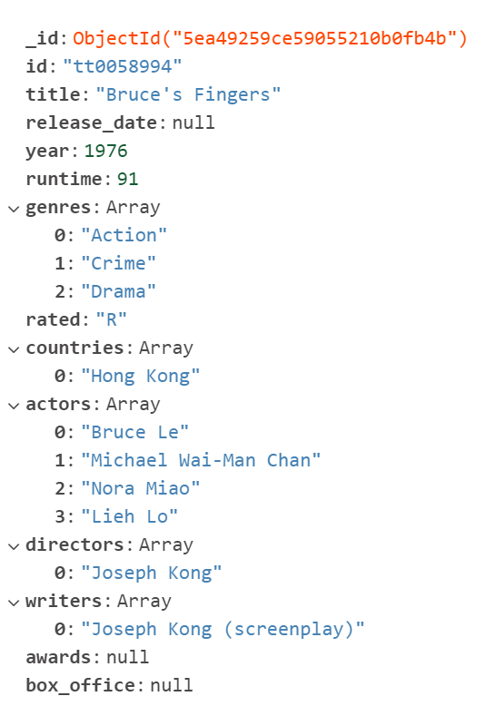

<h1>Project 2: ETL Challenge</h1>
<h3>Authors: John Jostes and Tim Lucas</h3>

This project was designed to follow the extract, transform and load steps for ETL. 
We chose to focus on movie data from the 1970s within the Action genre for our target data set.

<h3>Extract</h3>

During the extraction phase we focused on collecting our data in two different ways. The first step was to download two seperate .tsv files from
the IMDb (Internet Movie Database) website. These files were extremely large (at about 500MB each) so we knew there was going to be a lot of 
transformation required. The resources we used for downloading these files can be found here.

<h6>IMDb Datasets</h6>
<ul>
<li>Documentation: <a href="https://www.imdb.com/interfaces/" target="_blank">https://www.imdb.com/interfaces/</a></li>
<li>Downloads: <a href="https://datasets.imdbws.com/" target="_blank">https://datasets.imdbws.com/</a></li>
</ul>

This data contained a lot of great information but was also missing a lot of valuable information. We found the OMDb API (Open Movie Database) contained
some of the missing information we were interested in such as awards, box office numbers, country, etc. Our second step in extraction was setting up an API key
and making a pledge to the OMDb Patreon so that we could make more than 1,000 API calls and collect the missing data we needed. We did this utilizeing the movie 
id's provided by the IMDb files and creating a for loop that would make individual API calls for each movie and extracting the information we needed from each response.
<h6>OMDb API - The Open Movie Database</h6>
<ul>
<li>Documentation: <a href="http://www.omdbapi.com/" target="_blank">http://www.omdbapi.com/</a></li>
<li>Endpoint: http://www.omdbapi.com/?i={movie_id}&apikey={api_key}</li>
</ul>

The data extraction went very smooth and we started with close to 7 million records before transformation, and made just over 2,000 api calls to complete the extraction portion of this project.

<h3>Transform</h3>

Transforming this data took place throughout and after the extraction process. We first transformed the original IMDb data sets and narrowed our list of movies down to just 2,400, Using Pandas, this was done first by limiting our search to non-adult media and movies, as opposed to TV and other mediums. From here, it was a process of honing in on an arbitrary decade, the 1970s, and those genres that included 'Action' as a description.
In the end, this enabled us to make fewer API calls and create a curated dataset of 1970s action movies from all around the world.

<h3>Load</h3>

For loading our data we decided to use a cloud based mongo server. We utilized the free db options offered by Mongo Atlas and created our movie_db database with a single collection
of movies. We used Mongo Compass to import the json file and the command line to connect to the remote db and verify that our records loaded properly and could be queried.

<h3>Database Collection Document Sample</h3>

